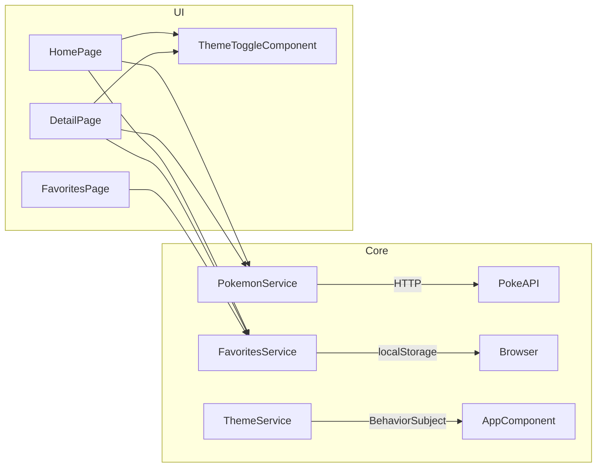

# Arquitetura e Componentes

## Camadas

### Core/Services

- PokemonService → consome PokeAPI

- FavoritesService → gerencia favoritos no localStorage

- ThemeService → troca tema via BehaviorSubject e CSS vars

### Pages

- HomePage → listagem + paginação + filtro

- DetailPage → detalhes + carrossel de sprites + favoritos

- FavoritesPage → lista dos Pokémon marcados

### Shared Components

- ThemeToggleComponent → botão de alternância de tema
