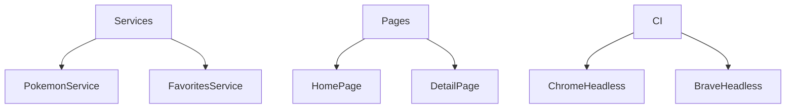

# Estratégia de Testes

## Como Rodar

- Todos: npm test

- CI: npm run test:ci

- Chrome real: npm run test:chrome

- Brave headless: npm run test:brave

### Cobertura

- **PokemonService**: 100%

- **FavoritesService**: 100%

- **ThemeService**: 100%

- **HomePage & DetailPage**: renderização e chamadas simuladas
